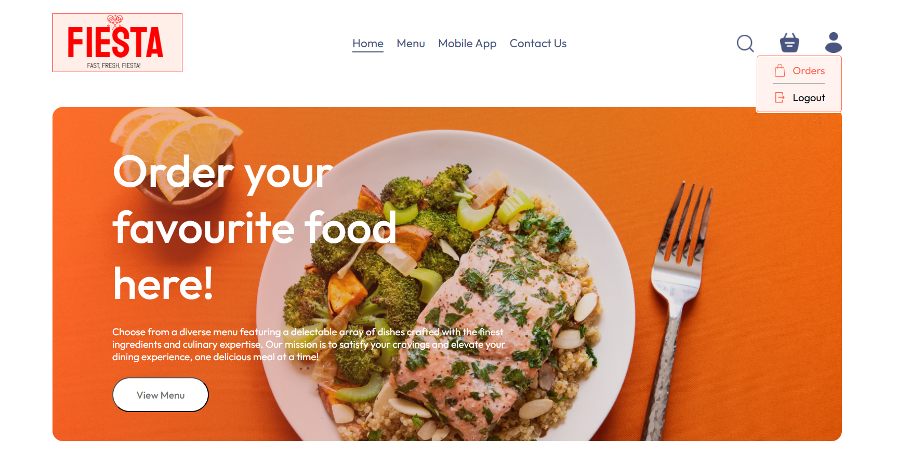
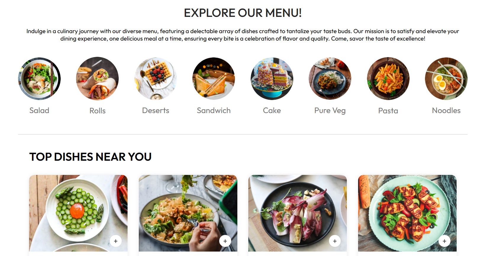
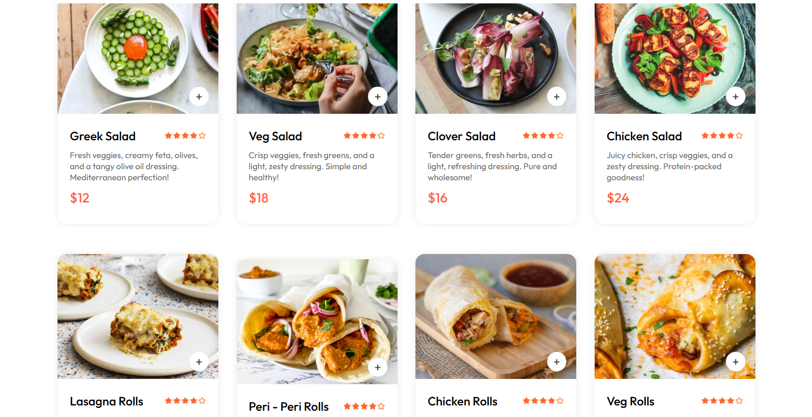
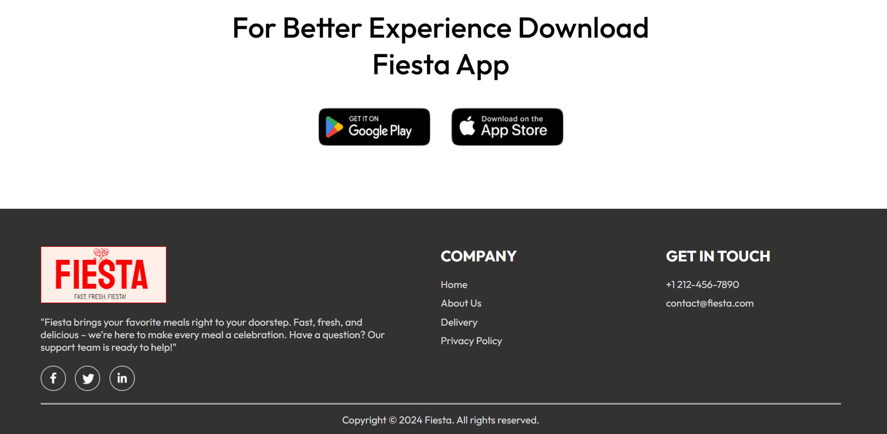
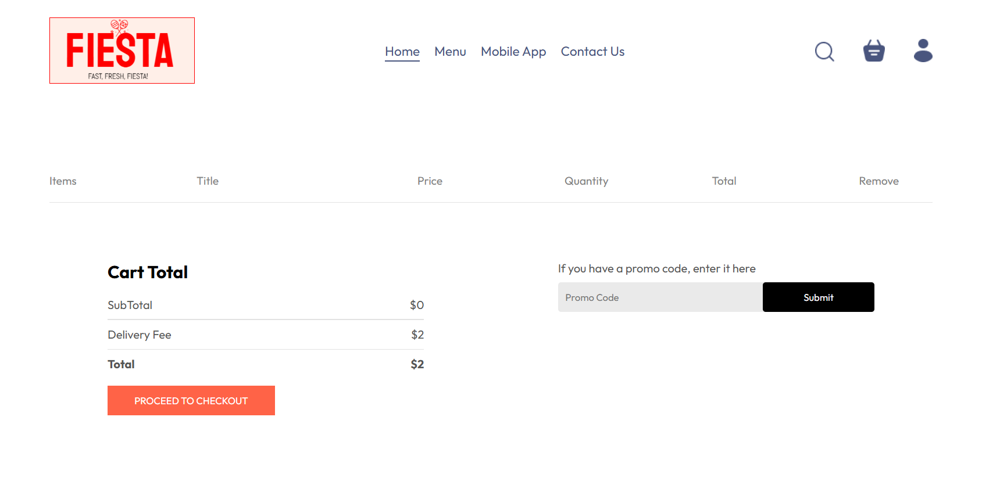
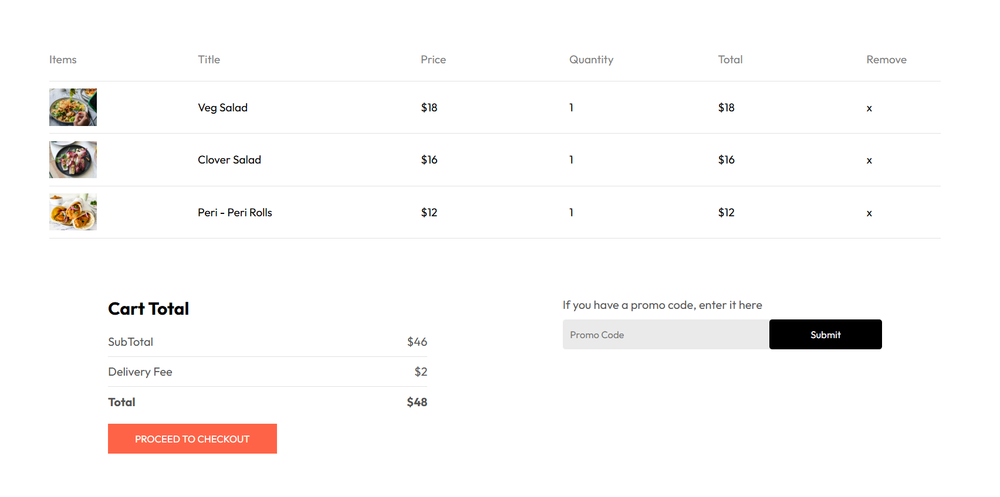
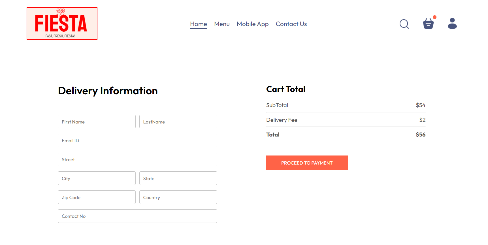
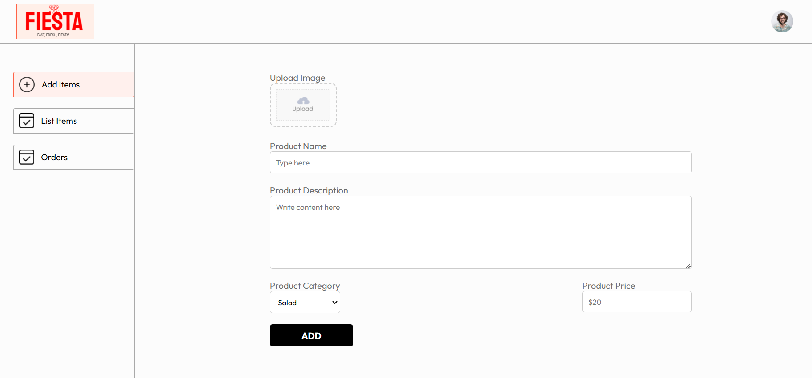

 ## Tools: React.js, Node.js, Express.js, MongoDB, Stripe

 
 ◦ Developed a full-stack food ordering application, Fiesta, using React JS, Node.js, Express, MongoDB, and
 Stripe Payment Gateway.
 
 ◦ Built and integrated shopping cart with Stripe for Fiesta, reducing checkout abandonment by 30% and
 improving cross-device user experience.
 
 ◦ Designed real-time order tracking and scalable RESTful APIs for efficient order management.
 
 ◦ Implemented user authentication for secure account creation and login functionality.

##  Screenshots

### 🏠 Homepage

### 🛒 Cart Page

###  Admin Page

